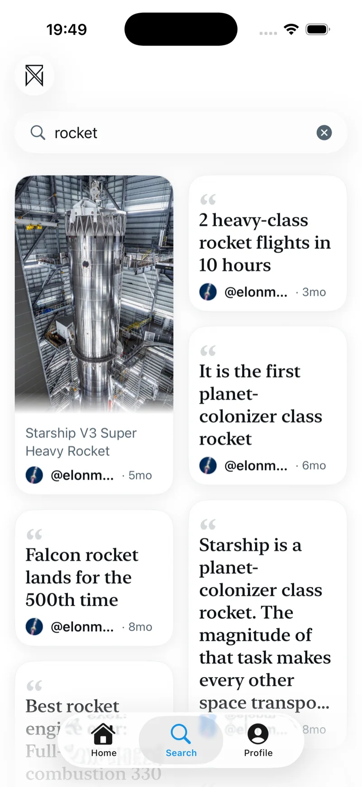
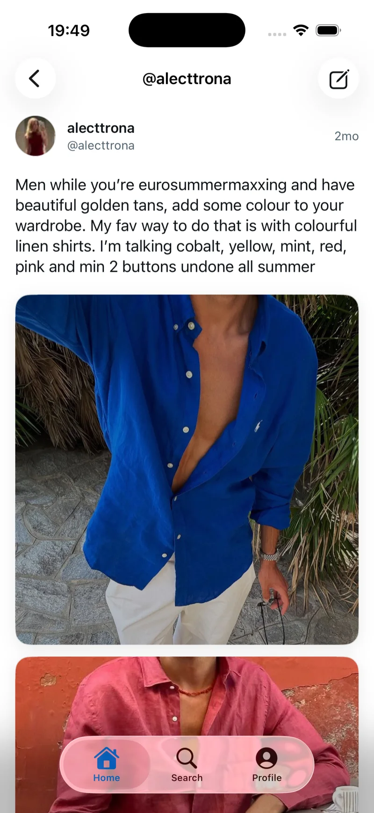
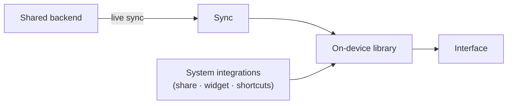

  

  # XSaved for iOS

  A native iPhone app that turns your X (Twitter) bookmarks into a calm, searchable library.

  **TestFlight beta · in active development**

   

  <table>
    <tr>
      <td width="33%"></td>
      <td width="33%"></td>
      <td width="33%"></td>
    </tr>
  </table>

 

> This repository is a public overview of the iOS app — what it does, how it's designed, and a few of the problems worth writing about. The source code is private.
>
> It's part of a small family of XSaved apps: a [browser extension](https://github.com/AitorGallardo/xsaved-showcase), a [Mac app](https://github.com/AitorGallardo/xsaved-mac-showcase), and this one, sharing one design language and one backend.

## Overview

X bookmarks pile up faster than anyone can use them. The native list has no search, no organization, and no sense of what you actually saved — and that's most painful on the phone, where most saving happens.

XSaved for iOS replaces that list with a library that feels like a first-party app:

- A scrollable, image-forward grid of everything you've saved — text-only tweets become clean quote cards.
- Search that filters the whole library as you type.
- A detail view with full media, notes, and tags.
- Saving from anywhere in the system, a home-screen widget, and live sync so a bookmark saved on another device shows up here on its own.

## Worth writing about

A few problems that took real work to get right.

### A grid that stays smooth at any size

The obvious way to build a two-column masonry grid with the system's declarative UI tools has a catch: it either won't scroll past the first screen, or it rebuilds every card on each change and stutters once the library grows.

The fix was to build the grid on a recycling layout that keeps only what's near the viewport alive, sizes each card to the true shape of its image so nothing reflows, and balances the two columns as cards stream in. The result holds a steady frame rate whether you've saved fifty bookmarks or thousands.

### Media that never gets in the way of scrolling

A grid full of photos and video is easy to make janky. Each card loads a right-sized version of its image rather than the full file, and only starts loading once it settles on screen — so flinging past a hundred cards queues nothing, and the ones you stop on appear right away. Video previews play quietly in place and hand off to full playback on tap.

### A design system treated as the rule, not a suggestion

Every color, type style, spacing value, and motion comes from one place. Features aren't allowed to invent their own — so the app stays consistent as it grows, and new screens look like they belong next to the rest.

## How it fits together

The phone is a reader and a quick-saver. The heavier work of collecting bookmarks happens elsewhere in the ecosystem; the app reads a clean, already-organized library from a shared backend and keeps it up to date.

More detail — kept at a high level on purpose — lives in [docs/ARCHITECTURE.md](docs/ARCHITECTURE.md).

## More

- [docs/PRODUCT.md](docs/PRODUCT.md) — what it is, who it's for, and the thinking behind it
- [docs/ARCHITECTURE.md](docs/ARCHITECTURE.md) — how the app is put together, at a high level
- [docs/ROADMAP.md](docs/ROADMAP.md) — what's shipped and what's next

---

  <a href="https://xsaved.com">xsaved.com</a> · <a href="https://github.com/AitorGallardo/xsaved-mac-showcase">Mac app</a> · <a href="https://github.com/AitorGallardo/xsaved-showcase">browser extension</a>
   
  Documentation only — the product source is private.

