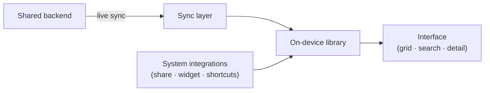

# Architecture

A high-level look at how the app is put together. It stays general by design — the goal is to explain the shape, not hand over the blueprint.

## The shape

The app is a reader and quick-saver on top of a shared library. It doesn't collect bookmarks itself — that happens elsewhere in the ecosystem — so the app can stay focused on browsing, searching, and adding to the library, and on doing all of that smoothly.

Four parts:

- **A design system** that every screen draws from — one source for color, type, spacing, and motion.
- **The interface** — the grid, search, and detail views, built natively.
- **An on-device library** that the app reads from and writes to, shared with its system extensions so anything saved anywhere shows up everywhere.
- **A sync layer** that keeps the library current and brings in new saves on their own.

## A few decisions worth noting

**The grid is custom for a reason.** The built-in declarative layout couldn't both scroll correctly and stay smooth once a library grows large. The grid is built on a recycling layout that keeps only what's near the screen alive, sizes each card to its image so nothing jumps, and balances the columns as content streams in.

**Media is loaded carefully.** Each card pulls a right-sized image rather than the full file, and waits until it settles on screen before loading — so fast scrolling never stacks up a backlog of downloads. Video previews play in place and hand off to full playback on tap.

**The phone stays a reader.** Keeping the heavy collection work off the phone keeps it fast and battery-friendly, and means the app isn't exposed to the churn of the source platform — it reads a clean, stable library instead.

## Honest notes

- The on-device store is deliberately simple today; a richer one is on the roadmap.
- Search on the phone is currently lighter than on the desktop; bringing it to parity is next.
